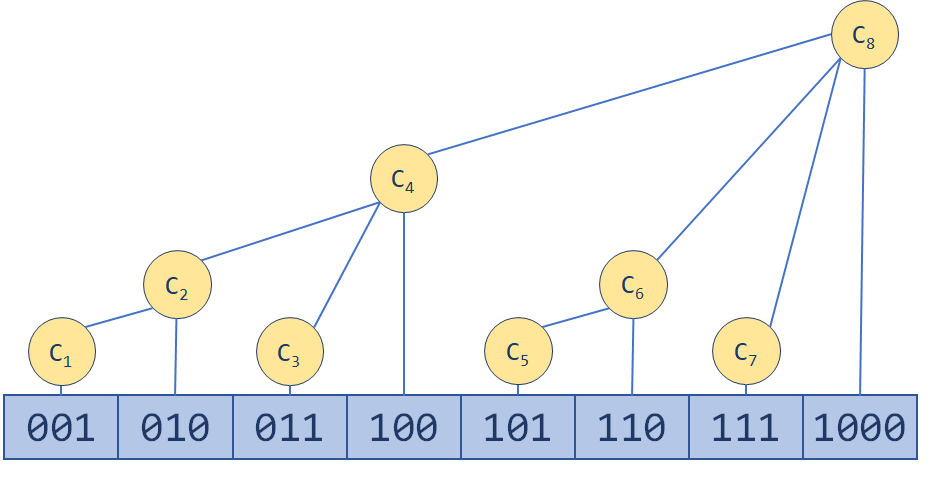

> https://zhuanlan.zhihu.com/p/93795692

# 树状数组

树状数组（**B**inary **I**ndex **T**ree, **BIT**）也是很多OIer心中最简洁优美的数据结构之一。最简单的树状数组支持两种操作，时间复杂度均为 ![[公式]](https://www.zhihu.com/equation?tex=O%28%5Clog+n%29) ：

- **单点修改**：更改数组中一个元素的值
- **区间查询**：查询一个区间内所有元素的和

### 传统数组

时间复杂度：

1. 单点更新：$O(1)$
2. 单点查询：$O(1)$
3. 区间更新：$O(n)$
4. 区间查询：$O(n)$

### 树状数组

时间复杂度：

1. 单点更新：$O(log\ n)$
2. 区间查询：$O(log\ n)$

> **Problem Description**
>
> C国的死对头A国这段时间正在进行军事演习，所以C国间谍头子Derek和他手下Tidy又开始忙乎了。A国在海岸线沿直线布置了N个工兵营地,Derek和Tidy的任务就是要监视这些工兵营地的活动情况。由于采取了某种先进的监测手段，所以每个工兵营地的人数C国都掌握的一清二楚,每个工兵营地的人数都有可能发生变动，可能增加或减少若干人手,但这些都逃不过C国的监视。
>
> 中央情报局要研究敌人究竟演习什么战术,所以Tidy要随时向Derek汇报某一段连续的工兵营地一共有多少人,例如Derek问:“Tidy,马上汇报第3个营地到第10个营地共有多少人!”Tidy就要马上开始计算这一段的总人数并汇报。但敌兵营地的人数经常变动，而Derek每次询问的段都不一样，所以Tidy不得不每次都一个一个营地的去数，很快就精疲力尽了，Derek对Tidy的计算速度越来越不满:"你个死肥仔，算得这么慢，我炒你鱿鱼!”Tidy想：“你自己来算算看，这可真是一项累人的工作!我恨不得你炒我鱿鱼呢!”无奈之下，Tidy只好打电话向计算机专家Windbreaker求救,Windbreaker说：“死肥仔，叫你平时做多点acm题和看多点算法书，现在尝到苦果了吧!”Tidy说："我知错了。。。"但Windbreaker已经挂掉电话了。Tidy很苦恼，这么算他真的会崩溃的，聪明的读者，你能写个程序帮他完成这项工作吗？不过如果你的程序效率不够高的话，Tidy还是会受到Derek的责骂的.
>
> **Input**
>
> 第一行一个整数T，表示有T组数据。
>
> 每组数据第一行一个正整数N（N<=50000）,表示敌人有N个工兵营地，接下来有N个正整数,第i个正整数ai代表第i个工兵营地里开始时有ai个人（1<=ai<=50）。
>
> 接下来每行有一条命令，命令有4种形式：
> (1) Add i j,i和j为正整数,表示第i个营地增加j个人（j不超过30）
> (2)Sub i j ,i和j为正整数,表示第i个营地减少j个人（j不超过30）;
> (3)Query i j ,i和j为正整数,i<=j，表示询问第i到第j个营地的总人数;
> (4)End 表示结束，这条命令在每组数据最后出现;
>
> 每组数据最多有40000条命令
>
> **Output**
>
> 对第i组数据,首先输出“Case i:”和回车,
> 对于每个Query询问，输出一个整数并回车,表示询问的段中的总人数,这个数保持在int以内。



- C[1] = A[1];
- C[2] = A[1] + A[2];
- C[3] = A[3];
- C[4] = A[1] + A[2] + A[3] + A[4];
- C[5] = A[5];
- C[6] = A[5] + A[6];
- C[7] = A[7];
- C[8] = A[1] + A[2] + A[3] + A[4] + A[5] + A[6] + A[7] + A[8];

$$
C[i] = A[i - 2^k+1] + A[i - 2^k+2] + ... + A[i]
$$

**$k$ 为 $i$ 的二进制中从最低位到高位连续零的长度**

当我们输入一个$A[1]$时，我们需要更新$C[1], C[2], C[4], C[8]$

当我们输入一个$A[2]$时，我们需要更新$C[2], C[4], C[8]$

当我们输入一个$A[3]$时，我们需要更新$C[3], C[4], C[8]$


即，当我们输入 $A[i]$ 我们需要更新：
$$
\begin{equation}\begin{split} 
&C[i] \\
&C[i + 2^{k_1}] \\
&C[i + 2^{k_1} + 2^{k_2}] \\
&...
\end{split}\end{equation}
$$

不过我们需要先解决一个问题：**$2^k$怎么算？($k$ 为 $i$ 的二进制中从最低位到高位连续零的长度)**

我们有这样神奇的一个公式：
$$
2^k = (i) \& (-i)
$$

如：

$$
\begin{equation}\begin{split} 
 &7\ 的补码 = 原码 = (0111)_2 \\
 -&7\ 的补码 = 7\ 的原码取反(1000)_2 + (0001)_2 = (1001)_2 \\[2ex]
 &(0111)_2 \& (1001)_2 = (0001)_2 = (1)_{10} \\[2ex]
\end{split}\end{equation}
$$

$ i = 7, k = 0, 2^0 = 1上述公式正确$

```c
#define lowbit(x) ((x) & (-x))

/**
 * @description: 更新：在 i 位置 +(-) x
 * @param {type}    tree {int *} 树状数组的首地址
 *                  len {int} 树状数组的长度
 *                  i {int} 树状数组元素的下标，** i从1开始 **
 *                  x {int} 增/减 的值
 */
void update(int *tree, int len, int i, int x)
{
    for (int pos = i; pos < len; pos += lowbit(pos)) {
        tree[pos] += x;
    }
}
```


区间查询（求和）：比如我们要找前7项和，那么应该是
$$
\begin{equation}\begin{split} 
SUM &= C[7] + C[6] + C[4] \\
&= (A[7]) + (A[5] + A[6]) + (A[1] + A[2] + A[3] + A[4])
\end{split}\end{equation}
$$

根据上面的式子，容易的出
$$
\begin{equation}\begin{split} 
SUM_i &= C[i] \\
            &+ C[i-2^{k_1}] \\
      &+ C[i - 2^{k_1} - 2^{k_2}] \\
      &+ \ ...
\end{split}\end{equation}
$$

```c
/**
 * @description: 求：1 到 i 项的和
 * @param {type}    tree {int *} 树状数组的首地址
 *                  i {int} 树状数组元素的下标，** i从1开始 **
 */
int sum(int *tree, int i)
{
    int ans = 0;
    for (int pos = i; pos; pos -= lowbit(pos)) {
        ans += tree[pos];
    }
    return ans;
}

/**
 * @description: 求：left 到 right 项的和
 * @param {type}    tree {int *} 树状数组的首地址
 *                  left {int}  树状数组元素的下标，** i从1开始 **
 *                  right {int} 树状数组元素的下标，** i从1开始 **
 */
int sum_range(int *tree, int left, int right)
{
    return sum(tree, right) - sum(tree, left - 1);
}
```

### 差分树状数组

1. 单点查询：$O(log\ n)$
2. 区间更新：$O(log\ n)$

- D[0] = A[0] = 0;
- D[1] = A[1] - A[0];
- D[2] = A[2] - A[1];
- D[3] = A[3] - A[2];
- D[4] = A[4] - A[3];
- D[5] = A[5] - A[4];
- D[6] = A[6] - A[5];
- D[7] = A[7] - A[6];
- D[8] = A[8] - A[7];

例如对于下面这个数组

- A[] = 1 2 3 5 6 9
- D[] = 1 1 1 2 1 3

如果我们把[2,5]区间内值加上2，则变成了

- A[] = 1 4 5 7 8 9
- D[] = 1 3 **1 2 1** 1

### 双差分树状数组

1. 区间查询：$O(log\ n)$
2. 区间更新：$O(log\ n)$

